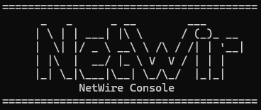
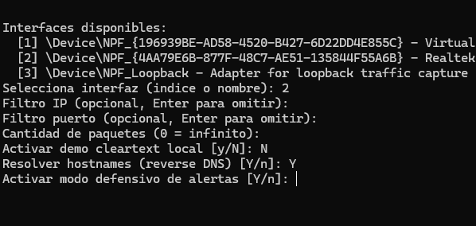

# NetWire Sniffer Lite (C++ / Windows)




Herramienta profesional de observabilidad de red orientada a operación técnica real: captura TCP en tiempo real, enriquecimiento de destino por hostname/proveedor y alertas defensivas para análisis rápido de riesgo.


## Resumen ejecutivo
Este proyecto implementa un sniffer IPv4/TCP en C++17 sobre Npcap/WinPcap, diseñado con arquitectura modular y foco en mantenibilidad.




Está orientado a escenarios de soporte técnico, troubleshooting de conectividad, validación post-despliegue, revisión de dependencias externas (CDN/cloud) y monitoreo defensivo inicial.

## Capacidades principales
- Captura de paquetes TCP por interfaz local (Npcap/WinPcap).
- Filtro BPF por IP y/o puerto.
- Parseo de headers IP/TCP y payload.
- Detección de HTTP requests:
  - request line
  - host
  - user-agent
  - basic auth y campos tipo password (modo controlado)
- Detección de hostname en HTTPS vía SNI (TLS ClientHello) + fallback reverse DNS.
- Clasificación de proveedor de red/CDN en salida (`net:akamai`, `net:cloudflare`, etc.).
- Modo defensivo con alertas de severidad:
  - puerto saliente no común
  - patrón similar a reverse shell (heurístico)
  - patrón beaconing por paquetes pequeños
  - flujo persistente hacia destino no clasificado
- Doble vista operativa:
  - consola principal de captura
  - consola adicional de alertas en modo defensivo interactivo
- Modos de ejecución:
  - CLI por argumentos
  - interactivo (al ejecutar sin argumentos o con `--interactive`)

## Arquitectura
Estructura por capas con separación de responsabilidades:

```text
include/netwire/
  app/       -> orquestación principal del sniffer
  capture/   -> sesión pcap e interfaces
  cli/       -> parseo de argumentos y asistente interactivo
  core/      -> modelos, utilidades y resolución de hostname
  filter/    -> construcción de filtros BPF
  parsing/   -> parsing HTTP, TLS(SNI), IP y TCP

src/
  main.cpp
  app/SnifferApp.cpp
  capture/PcapSession.cpp
  cli/Arguments.cpp
  core/HostnameResolver.cpp
  core/Text.cpp
  filter/BpfBuilder.cpp
  parsing/HttpParser.cpp
  parsing/TlsParser.cpp
  parsing/PacketParser.cpp
```

## Decisiones de diseño relevantes
- Flujo de captura y parsing desacoplado por módulos.
- Enriquecimiento de destino por flujo (correlación bidireccional) para mejorar lectura de hosts.
- Heurísticas defensivas con deduplicación por flujo para evitar spam de alertas repetidas.
- Salida compacta para operación diaria y troubleshooting rápido.
- Integración automática de consola de alertas cuando el modo defensivo se activa en asistente interactivo.

## Flujo de ejecución
1. Entrada por CLI o asistente interactivo.
2. Selección/resolución de interfaz.
3. Construcción de filtro BPF según opciones.
4. Captura TCP en tiempo real.
5. Parsing por paquete:
   - IP/TCP
   - HTTP (si aplica)
   - TLS SNI (si aplica)
6. Enriquecimiento de endpoint con hostname/proveedor.
7. Evaluación de reglas defensivas (si activado).
8. Emisión de salida en consola y alertas.

## Requisitos
- Windows
- Npcap o WinPcap instalado
- SDK de Npcap/WinPcap disponible (`pcap.h`, `wpcap.lib`, `Packet.lib`)
- CMake 3.16+
- Compilador C++17 (MSVC recomendado)

## Compilación
```powershell
cmake -S . -B build -DNPCAP_SDK_PATH="C:\Program Files\Npcap SDK"
cmake --build build --config Release
```

Binario generado:

```text
build/Release/sniffer_lite.exe
```

## Uso
### 1) Modo interactivo
```powershell
.\build\Release\sniffer_lite.exe
```

El asistente solicita:
- interfaz
- filtros IP/puerto
- cantidad de paquetes
- demo cleartext
- resolución de hostname
- modo defensivo

### 2) Modo CLI
```powershell
.\build\Release\sniffer_lite.exe --help
```

Opciones disponibles:
- `--iface <indice|nombre>`
- `--ip <IPv4>`
- `--port <1-65535>`
- `--count <N>`
- `--demo-cleartext`
- `--no-hostname`
- `--defensive`
- `--interactive`

## Ejemplos profesionales
Captura básica en interfaz de producción:

```powershell
.\build\Release\sniffer_lite.exe --iface 2 --count 200
```

Análisis de tráfico web por puerto:

```powershell
.\build\Release\sniffer_lite.exe --iface 2 --port 443 --count 300
```

Diagnóstico defensivo con alertas:

```powershell
.\build\Release\sniffer_lite.exe --iface 2 --defensive
```

Laboratorio local de credenciales en texto plano (controlado):

```powershell
.\build\Release\sniffer_lite.exe --iface 3 --port 8080 --demo-cleartext
```

## Interpretación de alertas defensivas
- `ALTA`: patrón de mayor riesgo (ej. heurística tipo reverse shell).
- `MEDIA`: comportamiento anómalo relevante (puerto no común, beaconing).
- `BAJA`: patrón persistente potencialmente revisable.

Estas alertas son heurísticas operativas y deben confirmarse con otras fuentes (EDR/SIEM/logs de proceso).

## Nota de seguridad
Usa esta herramienta solo en redes, equipos y tráfico donde tengas autorización explícita.

El modo `--demo-cleartext` está limitado a entorno de laboratorio controlado y no debe utilizarse para inspección no autorizada.
